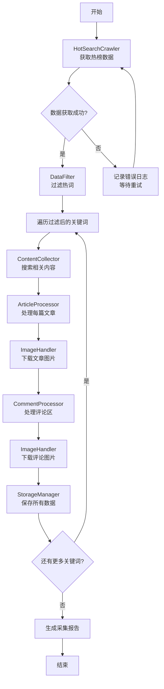

# 微博热榜爬虫项目框架搭建与角色 Skills 设计方案

## 一、项目概述

### 1.1 项目目标
构建一个自动化的微博热榜数据采集与处理系统，实现：
- 热榜数据实时采集与智能过滤
- 热门话题深度内容抓取（文章+评论）
- 多媒体数据（文本、图片）结构化存储
- 模块化架构支持灵活扩展

### 1.2 技术栈选择
- **语言**: Python 3.8+
- **浏览器自动化**: **Playwright**（推荐）或 Selenium - 用于页面渲染和截图
- **HTTP请求**: requests + aiohttp（异步支持，用于API数据获取）
- **HTML解析**: BeautifulSoup4 + lxml
- **数据处理**: pandas
- **图片处理**: Pillow
- **数据存储**: JSON + 文件系统（可扩展数据库）
- **配置管理**: YAML/JSON配置文件
- **日志系统**: logging模块

**关键说明**: 本项目核心特色是使用**真实浏览器渲染**进行可视化截图，而非简单的数据提取！

---

## 二、项目目录结构设计

```
weibo_hot_reasele/
├── README.md                    # 项目说明文档
├── requirements.txt             # 依赖包列表
├── config.yaml                  # 主配置文件
├── main.py                      # 程序入口
│
├── core/                        # 核心框架层
│   ├── __init__.py
│   ├── base.py                  # 基础类定义（BaseSkill, BaseProcessor）
│   ├── pipeline.py              # 数据流水线管理器
│   └── exceptions.py            # 自定义异常类
│
├── skills/                      # 角色Skills模块
│   ├── __init__.py
│   ├── hotsearch_crawler.py     # Skill 1: 热榜数据采集器（API）
│   ├── data_filter.py           # Skill 2: 数据过滤器
│   ├── browser_controller.py    # Skill 3: 浏览器控制器（Playwright）
│   ├── article_screenshot.py    # Skill 4: 文章截图处理器 ⭐核心
│   ├── comment_screenshot.py    # Skill 5: 评论截图处理器 ⭐核心
│   ├── data_extractor.py        # Skill 6: 文本/元数据提取器
│   └── storage_manager.py       # Skill 7: 数据存储管理器
│
├── utils/                       # 工具函数库
│   ├── __init__.py
│   ├── http_client.py           # HTTP客户端封装（用于API请求）
│   ├── logger.py                # 日志工具
│   ├── file_utils.py            # 文件操作工具
│   └── date_utils.py            # 时间处理工具
│
├── models/                      # 数据模型定义
│   ├── __init__.py
│   ├── hotsearch_model.py       # 热榜数据模型
│   ├── article_model.py         # 文章数据模型（含截图路径）
│   └── comment_model.py         # 评论数据模型（含截图路径）
│
├── data/                        # 数据存储目录
│   ├── raw/                     # 原始JSON数据
│   ├── processed/               # 处理后结构化数据
│   ├── screenshots/             # 📸 浏览器渲染截图存储 ⭐核心
│   │   ├── articles/            # 文章完整页面截图
│   │   │   └── 20260523_新浪新闻_曝iPhone18Pro配色大换血_full.png
│   │   └── comments/            # 评论区页面截图
│   │       └── 20260523_新浪新闻_comment_001.png
│   └── logs/                    # 日志文件
│
└── tests/                       # 测试目录
    ├── __init__.py
    ├── test_skills/
    │   ├── test_hotsearch_crawler.py
    │   ├── test_browser_controller.py
    │   ├── test_article_screenshot.py
    │   └── ...
    └── test_integration/
        └── test_pipeline.py
```

---

## 三、核心角色 Skills 详细设计

### 🎯 Skill 1: HotSearchCrawler（热榜数据采集器）

**职责**: 从微博API获取实时热榜数据

**核心功能**:
```python
class HotSearchCrawler(BaseSkill):
    """
    热榜数据采集器
    
    功能定义:
    1. 请求微博热榜API: https://weibo.com/ajax/side/hotSearch
    2. 解析JSON响应数据
    3. 数据格式标准化（转换为HotSearchModel对象列表）
    4. 异常处理（网络超时、API限流、数据格式错误）
    5. 支持定时采集（可配置间隔时间）
    6. 请求头伪装与反爬策略
    """
    
    def fetch_hot_search(self) -> List[HotSearchModel]:
        """获取热榜数据"""
        
    def parse_response(self, json_data: dict) -> List[HotSearchModel]:
        """解析JSON数据"""
        
    def validate_data(self, item: dict) -> bool:
        """验证数据完整性"""
```

**输入**: API URL地址  
**输出**: `List[HotSearchModel]` 标准化数据对象列表  
**依赖**: `http_client`, `hotsearch_model`

---

### 🔍 Skill 2: DataFilter（智能数据过滤器）

**职责**: 根据业务规则过滤热榜数据

**核心功能**:
```python
class DataFilter(BaseSkill):
    """
    数据过滤器
    
    功能定义:
    1. 按icon_desc过滤：只保留"新"、"热"、"新热"等指定标签
    2. 关键词分类过滤：保留科技、娱乐、花边、体育类话题
    3. 黑名单机制：排除政府、政治、市政、时政类敏感词
    4. 排名范围过滤：可选TOP N筛选
    5. 热度阈值过滤：按num字段设置最低热度要求
    6. 自定义规则扩展接口
    """
    
    def filter_by_category(self, items: List[HotSearchModel], 
                          allowed_categories: List[str]) -> List[HotSearchModel]:
        """按类别过滤"""
        
    def filter_by_icon_type(self, items: List[HotSearchModel],
                           allowed_icons: List[str]) -> List[HotSearchModel]:
        """按图标类型过滤"""
        
    def apply_blacklist(self, items: List[HotSearchModel],
                       blacklist_keywords: List[str]) -> List[HotSearchModel]:
        """应用黑名单过滤"""
        
    def apply_all_filters(self, items: List[HotSearchModel]) -> List[HotSearchModel]:
        """执行所有过滤规则"""
```

**输入**: 原始热榜数据列表  
**输出**: 过滤后的目标数据列表  
**配置项**: 
- `allowed_categories`: ["科技", "娱乐", "花边", "体育"]
- `allowed_icons`: ["新", "热", "新热"]
- `blacklist_keywords`: ["政府", "政治", "时政"]

---

### 📰 Skill 3: ContentCollector（内容采集器）

**职责**: 根据关键词搜索并获取相关微博内容

**核心功能**:
```python
class ContentCollector(BaseSkill):
    """
    内容采集器
    
    功能定义:
    1. 构建搜索URL: https://s.weibo.com/weibo?q=#关键词#
    2. 解析搜索结果页面（动态加载内容处理）
    3. 提取微博文章列表（标题、正文摘要、发布时间、作者）
    4. 分页处理（滚动加载更多内容）
    5. 反爬虫策略（请求频率控制、User-Agent轮换）
    6. 重试机制（失败自动重试）
    """
    
    def search_by_keyword(self, keyword: str) -> List[ArticleModel]:
        """根据关键词搜索内容"""
        
    def parse_search_page(self, html: str) -> List[dict]:
        """解析搜索结果页面"""
        
    def extract_article_links(self, parsed_data: List[dict]) -> List[str]:
        """提取文章详情链接"""
        
    def load_more_content(self, page_url: str, max_pages: int = 5) -> List[dict]:
        """加载更多分页内容"""
```

**输入**: 过滤后的热榜关键词  
**输出**: `List[ArticleModel]` 文章数据列表  
**技术要点**: 
- 处理JavaScript动态渲染（可能需要Selenium/Playwright）
- Cookie管理与Session保持

---

### 📝 Skill 4: ArticleProcessor（文章处理器）

**职责**: 处理单篇文章的完整内容

**核心功能**:
```python
class ArticleProcessor(BaseSkill):
    """
    文章处理器
    
    功能定义:
    1. 访问文章详情页获取完整内容
    2. 提取文章正文文本（去除HTML标签）
    3. 提取作者信息（昵称、ID、头像链接）
    4. 截取/下载文章配图（多图支持）
    5. 提取元数据（发布时间、转发数、评论数、点赞数）
    6. 内容清洗（去除广告、无关链接）
    7. 结构化数据封装为ArticleModel
    """
    
    def process_article(self, article_url: str) -> ArticleModel:
        """处理单篇文章"""
        
    def extract_text_content(self, html: str) -> str:
        """提取纯文本内容"""
        
    def extract_author_info(self, html: str) -> dict:
        """提取作者信息"""
        
    def download_images(self, image_urls: List[str], 
                       save_dir: str) -> List[str]:
        """下载并保存图片"""
        
    def clean_content(self, text: str) -> str:
        """内容清洗"""
```

**输入**: 文章URL  
**输出**: 完整的`ArticleModel`对象（含文本、作者、图片路径）  
**协作**: 调用`ImageHandler`处理图片

---

### 💬 Skill 5: CommentProcessor（评论处理器）

**职责**: 处理文章评论区数据

**核心功能**:
```python
class CommentProcessor(BaseSkill):
    """
    评论处理器
    
    功能定义:
    1. 定位评论区DOM结构（处理多种页面布局）
    2. 提取评论文本内容
    3. 提取评论者信息（昵称、ID、头像）
    4. 截取/下载评论中的图片
    5. 处理嵌套回复（楼中楼）
    6. 评论排序（热门评论优先/时间顺序）
    7. 分页加载评论（加载更多）
    8. 情感分析标记（可选扩展）
    """
    
    def process_comments(self, article_url: str) -> List[CommentModel]:
        """处理某篇文章的所有评论"""
        
    def extract_comment_text(self, comment_element) -> str:
        """提取评论文本"""
        
    def extract_commenter_info(self, comment_element) -> dict:
        """提取评论者信息"""
        
    def handle_nested_replies(self, parent_comment) -> List[CommentModel]:
        """处理嵌套回复"""
        
    def load_more_comments(self, url: str, max_count: int = 100) -> List[CommentModel]:
        """加载更多评论"""
```

**输入**: 文章URL  
**输出**: `List[CommentModel]` 评论数据列表  
**特殊处理**: 
- 动态加载的评论（Ajax请求拦截或模拟滚动）
- 登录态要求（部分评论需要登录才能查看）

---

### 🖼️ Skill 6: ImageHandler（图片处理器）

**职责**: 统一的图片下载与管理

**核心功能**:
```python
class ImageHandler(BaseSkill):
    """
    图片处理器
    
    功能定义:
    1. 图片URL有效性检测
    2. 多线程/异步批量下载
    3. 图片格式转换（如需要）
    4. 文件命名规则（日期_关键词_序号.jpg）
    5. 存储路径管理（按日期/分类建立子目录）
    6. 重复下载检测（MD5去重）
    7. 下载失败重试机制
    8. 图片压缩优化（可选）
    """
    
    def download_image(self, url: str, save_path: str) -> bool:
        """下载单张图片"""
        
    def batch_download(self, urls: List[str], save_dir: str,
                      prefix: str = "") -> Dict[str, str]:
        """批量下载图片"""
        
    def generate_filename(self, keyword: str, index: int, 
                         ext: str = ".jpg") -> str:
        """生成文件名"""
        
    def is_duplicate(self, file_path: str) -> bool:
        """检查是否重复"""
        
    def optimize_image(self, file_path: str, quality: int = 85) -> bool:
        """图片优化压缩"""
```

**输入**: 图片URL列表  
**输出**: 本地文件路径映射字典  
**性能优化**: 使用`aiohttp`异步下载提升效率

---

### 💾 Skill 7: StorageManager（数据存储管理器）

**职责**: 统一的数据持久化管理

**核心功能**:
```python
class StorageManager(BaseSkill):
    """
    数据存储管理器
    
    功能定义:
    1. JSON格式化存储（热榜数据、文章数据、评论数据）
    2. 文件组织结构（按日期/关键词分层存储）
    3. 数据去重（避免重复采集）
    4. 存储状态记录（断点续传支持）
    5. 数据导出功能（CSV/Excel格式可选）
    6. 存储空间监控与清理
    7. 数据备份机制
    """
    
    def save_hot_search_data(self, data: List[HotSearchModel], 
                            date: str) -> str:
        """保存热榜数据"""
        
    def save_article_data(self, article: ArticleModel, 
                         keyword: str) -> str:
        """保存文章数据"""
        
    def save_comment_data(self, comments: List[CommentModel],
                         article_id: str) -> str:
        """保存评论数据"""
        
    def check_duplicate(self, data_id: str, data_type: str) -> bool:
        """检查数据是否已存在"""
        
    def export_to_csv(self, data: List, output_path: str) -> bool:
        """导出为CSV格式"""
        
    def cleanup_old_data(self, days: int = 30) -> int:
        """清理过期数据"""
```

**输入**: 各类数据模型对象  
**输出**: 文件存储路径 / 操作状态  
**存储结构示例**:
```
data/
├── raw/
│   └── 2026-05-23/
│       └── hotsearch_20260523_143022.json
├── processed/
│   └── 科技/
│       └── 曝iPhone18Pro配色大换血/
│           ├── article.json
│           └── comments.json
└── images/
    ├── articles/
    │   └── 20260523_曝iPhone18Pro配色大换血_001.jpg
    └── comments/
        └── 20260523_曝iPhone18Pro配色大换血_comment_001.jpg
```

---

## 四、核心基类设计

### BaseSkill 基类
```python
from abc import ABC, abstractmethod
from typing import Any, Dict, List
import logging

class BaseSkill(ABC):
    """
    角色技能基类
    
    所有Skills必须继承此类，确保统一接口规范
    """
    
    def __init__(self, config: Dict[str, Any], logger: logging.Logger):
        self.config = config
        self.logger = logger
        self.name = self.__class__.__name__
        self._initialize()
    
    def _initialize(self):
        """初始化资源（可重写）"""
        pass
    
    @abstractmethod
    def execute(self, *args, **kwargs) -> Any:
        """执行核心逻辑（必须实现）"""
        pass
    
    def validate_input(self, data: Any) -> bool:
        """输入验证（可重写）"""
        return True
    
    def on_success(self, result: Any):
        """成功回调"""
        self.logger.info(f"[{self.name}] 执行成功")
    
    def on_error(self, error: Exception):
        """错误回调"""
        self.logger.error(f"[{self.name}] 执行失败: {str(error)}")
        raise error
```

---

## 五、数据流水线设计（Pipeline）

### Pipeline 执行流程


### Pipeline Manager
```python
class PipelineManager:
    """
    流水线管理器
    
    协调所有Skills按照预定流程执行
    """
    
    def __init__(self, config_path: str):
        self.skills = {}
        self.pipeline_steps = []
        self._load_config(config_path)
        self._initialize_skills()
    
    def register_skill(self, skill_name: str, skill_instance: BaseSkill):
        """注册Skill"""
        self.skills[skill_name] = skill_instance
    
    def add_pipeline_step(self, step: Tuple[str, Callable]):
        """添加流水线步骤"""
        self.pipeline_steps.append(step)
    
    async def run(self):
        """执行完整流水线"""
        for step_name, step_func in self.pipeline_steps:
            try:
                result = await step_func()
                self.logger.info(f"步骤 [{step_name}] 完成")
            except Exception as e:
                self.logger.error(f"步骤 [{step_name}] 失败: {e}")
                self._handle_failure(step_name, e)
```

---

## 六、配置文件设计 (config.yaml)

```yaml
# 微博热榜爬虫配置文件

app:
  name: "weibo_hot_reasele"
  version: "1.0.0"
  debug: false

crawler:
  hotsearch_api: "https://weibo.com/ajax/side/hotSearch"
  search_url_template: "https://s.weibo.com/weibo?q={keyword}"
  request_interval: 2  # 请求间隔（秒）
  timeout: 30          # 超时时间（秒）
  retry_times: 3       # 重试次数
  user_agents:
    - "Mozilla/5.0 (Windows NT 10.0; Win64; x64)..."
    - "Mozilla/5.0 (Macintosh; Intel Mac OS X 10_15_7)..."

filter:
  allowed_categories:
    - "科技"
    - "娱乐"
    - "花边"
    - "体育"
  allowed_icons:
    - "新"
    - "热"
    - "新热"
  blacklist_keywords:
    - "政府"
    - "政治"
    - "市政"
    - "时政"
  min_hot_num: 10000      # 最低热度阈值
  top_n: 20              # 只取前N名

storage:
  base_dir: "./data"
  raw_data_dir: "raw"
  processed_data_dir: "processed"
  images_dir: "images"
  log_dir: "logs"
  export_format: "json"   # json/csv/excel
  auto_cleanup_days: 30   # 自动清理天数
  enable_backup: true

image:
  save_format: "JPEG"
  quality: 85
  max_size: 1920         # 最大宽度像素
  thread_pool_size: 5    # 下载线程数

logging:
  level: "INFO"
  format: "%(asctime)s - %(name)s - %(levelname)s - %(message)s"
  file_max_size: 10485760  # 10MB
  backup_count: 5

schedule:
  enabled: true
  interval_minutes: 30   # 采集间隔（分钟）
  start_time: "08:00"
  end_time: "23:00"
```

---

## 七、实施步骤清单

### 阶段1: 基础框架搭建 ✅
- [ ] 创建项目目录结构
- [ ] 编写 requirements.txt
- [ ] 创建 config.yaml 配置文件
- [ ] 实现 BaseSkill 基类
- [ ] 实现自定义异常类
- [ ] 封装 HTTP 客户端工具
- [ ] 配置日志系统

### 阶段2: 数据模型定义
- [ ] 实现 HotSearchModel
- [ ] 实现 ArticleModel
- [ ] 实现 CommentModel
- [ ] 编写模型序列化/反序列化方法

### 阶段3: Skills 开发（按优先级）
- [ ] **P0**: HotSearchCrawler（基础数据源）
- [ ] **P0**: DataFilter（数据质量控制）
- [ ] **P1**: ContentCollector（内容获取）
- [ ] **P1**: ArticleProcessor（文章处理）
- [ ] **P2**: CommentProcessor（评论处理）
- [ ] **P2**: ImageHandler（图片管理）
- [ ] **P1**: StorageManager（数据持久化）

### 阶段4: 流水线集成
- [ ] 实现 PipelineManager
- [ ] 编排执行流程
- [ ] 实现错误处理与重试机制
- [ ] 添加进度跟踪与报告

### 阶段5: 主程序入口
- [ ] 编写 main.py
- [ ] 实现命令行参数解析
- [ ] 添加定时任务调度（可选）

### 阶段6: 测试与优化
- [ ] 编写单元测试
- [ ] 性能测试与优化
- [ ] 反爬策略调优
- [ ] 文档完善

---

## 八、关键技术难点与解决方案

### 8.1 动态内容加载问题
**挑战**: 微博使用JavaScript动态渲染内容  
**解决方案**: 
- 方案A: 使用 Selenium/Playwright 模拟浏览器
- 方案B: 分析Ajax接口直接请求数据（推荐，性能更好）
- 方案C: 混合方案（静态用requests，动态用浏览器）

### 8.2 反爬虫机制应对
**挑战**: IP限制、请求频率限制、验证码  
**解决方案**:
- User-Agent池随机切换
- 请求间隔随机化（2-5秒）
- Cookie自动管理
- 代理IP池（可选）
- 验证码识别集成（可选）

### 8.3 大规模数据存储优化
**挑战**: 图片占用大量存储空间  
**解决方案**:
- 图片压缩（质量85%）
- 定期清理旧数据
- 按日期归档
- 可选云存储（OSS/S3）

### 8.4 并发性能优化
**挑战**: 单线程效率低下  
**解决方案**:
- asyncio + aiohttp 异步IO
- 图片下载多线程
- 生产者消费者模式
- 请求队列管理

---

## 九、扩展性设计

### 未来可扩展功能
1. **数据分析模块**: 热度趋势分析、情感分析
2. **可视化看板**: Web界面展示采集结果
3. **消息推送**: 采集完成通知（邮件/微信/钉钉）
4. **分布式部署**: 多节点协同采集
5. **数据库支持**: MySQL/MongoDB持久化
6. **API服务**: RESTful API供其他系统调用

---

## 十、总结

本方案采用**模块化 + 角色分工**的设计理念：

✅ **7个核心Skills**各司其职，职责清晰  
✅ **Pipeline流水线**协调工作流，易于维护  
✅ **BaseSkill基类**统一规范，便于扩展  
✅ **配置驱动**行为可调整，无需改代码  
✅ **完善的错误处理**保证系统稳定性  

下一步将按照实施步骤逐步开发每个模块。
